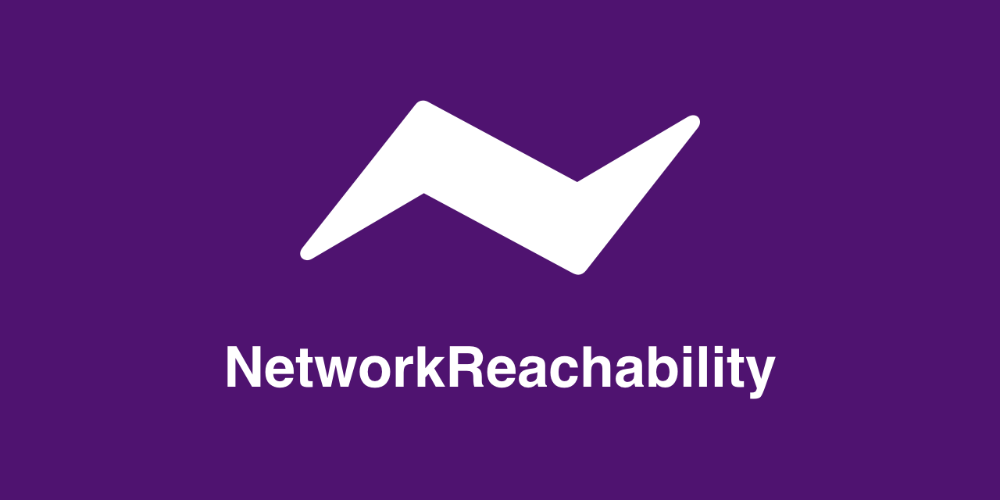

<p align="center">
  
</p>


NetworkReachability is a replacement for Apple's [SystemConfiguration](https://developer.apple.com/documentation/systemconfiguration) [Network Reachability APIs](https://developer.apple.com/documentation/systemconfiguration/scnetworkreachability?language=swift). Because these APIs were originally written in C, they are old and cumbersome to use from Swift. NetworkReachability wraps these APIs in Swift and provides a modern interface for the most common use cases.

NetworkReachability supports synchronous reachability queries, as well as constant asynchronous reachability observation via the following mechanisms:

* Delegation
* Closures
* [NotificationCenter](https://developer.apple.com/documentation/foundation/notificationcenter)
* [Swift Structured Concurrency](https://docs.swift.org/swift-book/LanguageGuide/Concurrency.html)
* [Combine](https://developer.apple.com/documentation/combine)

Large parts of the library's design are inspired by [this project](https://github.com/ashleymills/Reachability.swift) by [Ashley Mills](https://github.com/ashleymills), which was written before Swift 5.5 and the introduction of structured concurrency.

## Installation

NetworkReachability is currently distributed exclusively through the [Swift Package Manager](https://www.swift.org/package-manager/). 

To add NetworkReachability as a dependency to an existing Swift package, add the following line of code to the `packages` parameter of your `Package.swift` file:

```swift
dependencies: [
    .package(url: "https://github.com/vsanthanam/NetworkReachability.git", .upToNextMajor(from: "1.0.0"))
]
```

To add NetworkReachability as a dependency to an Xcode Project: 

- Choose File -> Swift Packages -> Add Package Dependency...
- Enter package URL `https://github.com/vsanthanam/NetworkReachability.git` and select your release and of choice.

Other distribution mechanisms like CocoaPods or Carthage may be added in the future.

## Usage & Documentation

NetworkReachability's documentation is built with [DocC](https://developer.apple.com/documentation/docc) and included in the repository as a DocC archive. The latest version is hosted on [GitHub Pages](https://pages.github.com) and is available [here](https://reachability.tools/docs/documentation/networkreachability).
